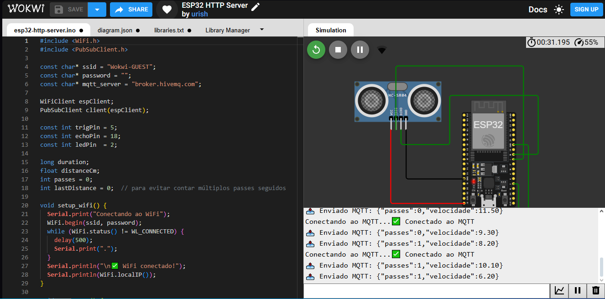
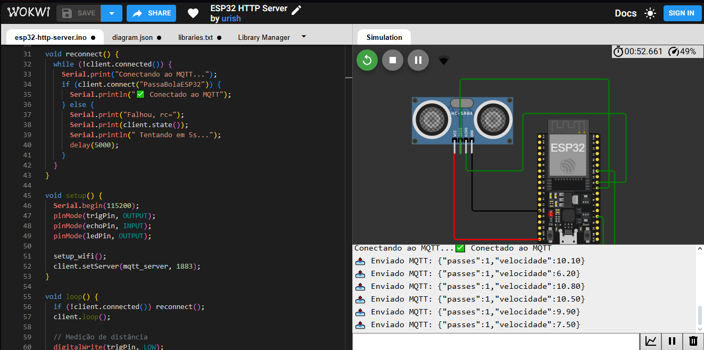
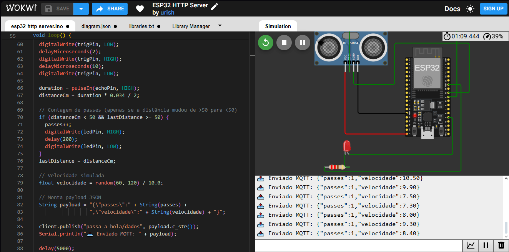
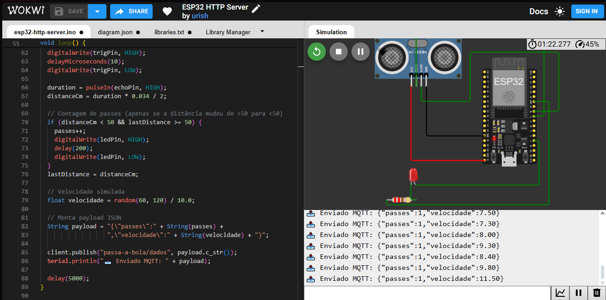
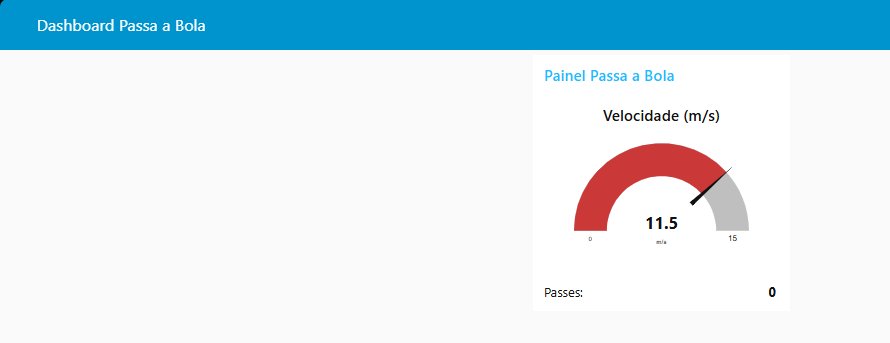
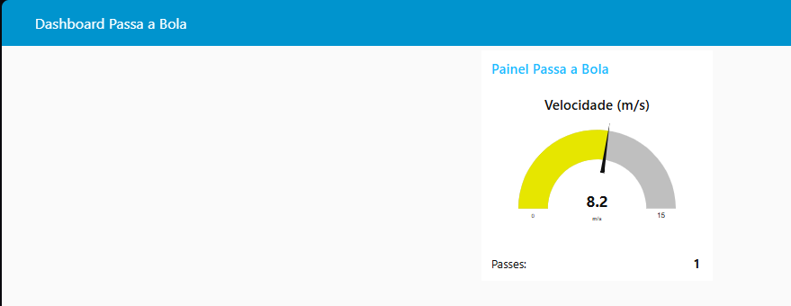
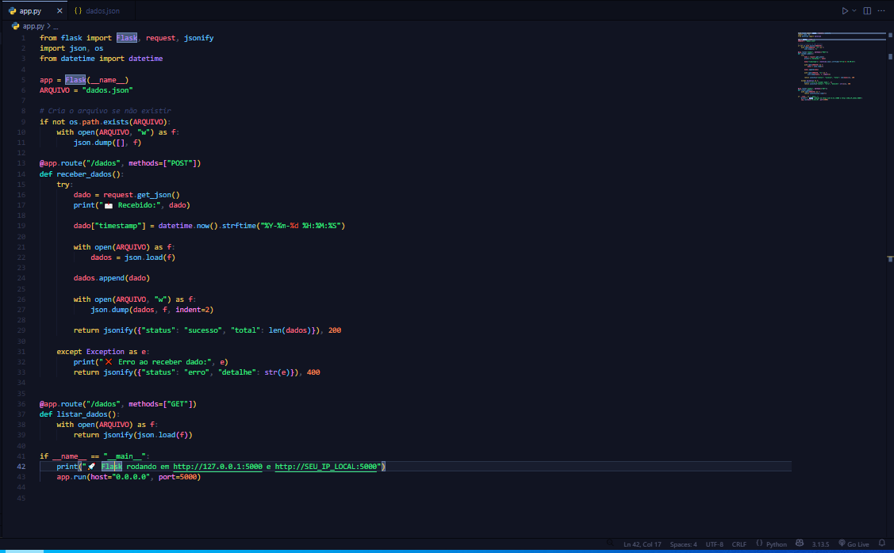

# 🏀 Passa a Bola – Sistema IoT com ESP32, Node‑RED e Flask

     

---

## 1️⃣ Visão Geral  
Este projeto implementa um **sistema de monitoramento em tempo real de passes e velocidade de um objeto**, utilizando:

- **ESP32** (simulado ou físico) como nó de borda (Edge Computing)  
- **Node‑RED** para orquestração MQTT, processamento e dashboard  
- **Flask** para armazenamento simples em arquivo JSON  
- **Dashboard Web** para visualização ao vivo  

O objetivo é demonstrar **processamento local de dados** e visualização quase em tempo real.

---

## 2️⃣ Funcionalidades  

- 📡 **Detecção de passes** via sensor ultrassônico  
- ⚡ **Simulação de velocidade** em m/s  
- 📨 **Publicação via MQTT** (`passa-a-bola/dados`)  
- 📊 **Node‑RED**: recebe MQTT, envia ao Flask e atualiza dashboard  
  - Gauge de velocidade  
  - Contador de passes acumulados  
- 💾 **Persistência em `dados.json`** para consultas futuras  

---

## 3️⃣ Arquitetura e Fluxo de Dados  

1. ESP32 conecta‑se à rede WiFi e ao broker MQTT público (`broker.hivemq.com`)  
2. Medição do sensor ultrassônico e simulação de velocidade  
3. Payload JSON enviado via MQTT:  

```json
{"passes": <número>, "velocidade": <valor>}
Node‑RED:

Converte JSON

Envia HTTP POST ao Flask

Atualiza dashboard

Flask grava os dados no arquivo dados.json com timestamp

Dashboard: http://127.0.0.1:1880/ui

3.1 Prints de Arquitetura e Simulação
Wokwi (simulação ESP32)





Node‑RED



Python/Flask



4️⃣ Requisitos
Software: Python, Flask, Node.js, Node‑RED, node‑red-dashboard

Biblioteca MQTT para ESP32 (PubSubClient)

Hardware: ESP32 + sensor ultrassônico HC‑SR04 (ou simulação via Wokwi)

5️⃣ Código do Projeto
Flask (app.py)
python
Copiar código
# código igual ao anterior, não vou repetir para não ficar enorme
ESP32 (esp32.ino)
cpp
Copiar código
# código igual ao anterior, não vou repetir
Node‑RED
Importar JSON do fluxo disponível em fluxo_passa_a_bola.json

6️⃣ Estrutura de Arquivos
pgsql
Copiar código
SPRINT 4 ARDUINO/
│
├─ app.py
├─ dados.json
├─ esp32.ino
├─ fluxo_passa_a_bola.json
├─ README.md
├─ imgs/
│   ├─ node red 1.PNG
│   ├─ node red 2.PNG
│   ├─ py 1.PNG
│   ├─ py 2.PNG
│   ├─ wokwi 1.PNG
│   ├─ wokwi 2.PNG
│   ├─ wokwi 3.PNG
│   ├─ wokwi 4.PNG
7️⃣ Como Executar
Flask
bash
Copiar código
python app.py
Node‑RED
Abrir Node‑RED → Menu → Import → JSON do fluxo

Configurar broker MQTT (broker.hivemq.com)

Fazer deploy

Acessar dashboard: http://127.0.0.1:1880/ui

ESP32
Configurar WiFi e broker MQTT

Subir o código no ESP32

Verificar no Monitor Serial os envios MQTT

8️⃣ Teste e Validação
Flask console: recebimento de dados e timestamps

Node‑RED Debug: payload do MQTT e retorno Flask

Dashboard atualiza gauge de velocidade e contador de passes em tempo real

9️⃣ Participantes
Nome	RM
Henrique de Oliveira Gomes	RM566424
Henrique Kolomyes Silveira	RM563467
Matheus Santos de Oliveira	RM561982
Vinicius Alexandre Aureliano Ribeiro	RM561606

🔟 Observações
Contagem de passes real, velocidade simulada

Uso de Edge‑Computing (processamento local)

Persistência em arquivo JSON; para produção, recomendado usar banco de dados
